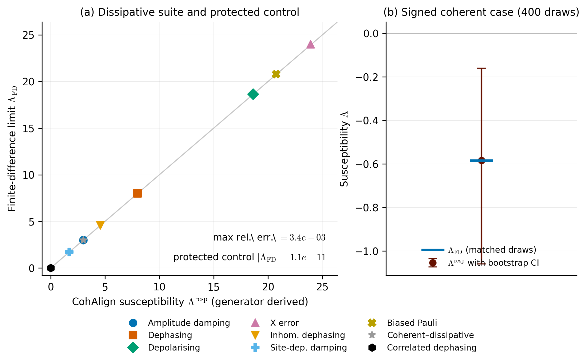

# CohAlign: Predicting the First-Order Noise Susceptibility of Gradients in Equivariant Quantum Neural Networks

*CohAlign: Predicting the First-Order Noise Susceptibility of Gradients in Equivariant Quantum Neural Networks*, by H. Ugail and N. Howard.

Training a variational quantum circuit means following gradients, and on real hardware those gradients are washed out by noise. A single scalar summary of the noise says nothing about where the damage falls, and a channel that contracts almost every coherence direction can leave a particular gradient entirely untouched, provided the directions it contracts are the ones the readout cannot see. **CohAlign is an open-source toolkit that computes, at design time and with no finite-noise circuit sweep, the first-order noise susceptibility of the initialisation-ensemble second moment of a specified parameter gradient**, resolved by parameter and by noise slot, from a classical description of the circuit, the noise generator, the prepared state, the readout and the initialisation prior. It distinguishes three progressively sharper quantities, the worst-case sector coherence rate, the operator mode-contraction rate, and the measured-response susceptibility, and the paper's central lesson is that the last two are genuinely different objects.



## What does this measure?

The headline findings, established in exact density-matrix simulation at eight qubits and validated against separately evaluated finite-difference derivatives on matched parameter ensembles, are:

1. **Operator contraction does not determine measured response.** An engineered correlated-dephasing control contracts the gradient-carrying operator mode at nearly the full worst-case rate (mode ratio 0.969) while the measured gradient degradation stays below 10⁻¹³ at every candidate parameter, exactly as the toolkit predicts from the generator and architecture alone.

2. **The computed susceptibility is the true first derivative.** Across the dissipative channel suite the generator-derived susceptibility agrees with the matched finite-difference limit to at most 3.4 × 10⁻³ relative error, which is precisely the shipped probe bias, and the protected control returns a finite-difference residual of order 10⁻¹¹.

3. **Signed coherent responses are captured, not just contraction.** A pure coherent site-dependent over-rotation gives a negative susceptibility of −0.584 on an enlarged matched ensemble of 400 draws, reproduced by the finite difference to 3.5 × 10⁻⁵, with a bootstrap interval excluding zero, so the framework measures gradient enhancement that no contraction metric can express.

4. **The prediction is genuinely parameter resolved.** At depth four, where the light cone breaks the shallow-geometry degeneracy, fourteen parameter-and-channel pairs across seven distinct locations span susceptibilities from 2.73 to 9.36, every point agreeing with its matched finite difference at the probe bias, and the locations dephasing degrades fastest are precisely the ones the correlated control leaves most protected.

5. **The response rate organises finite-noise data far better than the worst-case rate.** The predicted alignment matches defect-windowed measurements with RMSE 0.009 across eight distinct channels, and in the secondary pooled regression the response model reaches R² 0.998 at the primary window against 0.83 for the worst-case rate, the improvement strengthening monotonically as the window tightens.

## Contents

- **`cohalign_pipeline_v1.8.1.ipynb`** — the full reproduction notebook. Materialises the package modules verbatim from its source cells, runs the twenty-two-check self-test battery, the validation ladder (recovery, zero-alignment control, direct finite-difference validation, parameter-resolved map, family comparison, regression, depth, two-excitation sector, cost benchmark), and renders every figure. Autodetects Google Colab against local execution and runs in three modes, a smoke mode completing in minutes, a paper mode reproducing the full study in roughly two hours on a standard cloud processor, and a figures mode re-rendering every figure from cached CSVs. Each phase caches its results, so an interrupted run resumes where it stopped.

- **`verify_results.py`** — a quick verification script for reviewers. Loads the precomputed tables in `Results/` and confirms that every headline number in the paper is reproducible from those tables. Runs in a couple of seconds, needs no GPU, and prints a clean PASS/FAIL summary.

- **`cohalign/`** — the Python package. Contains the sector bookkeeping, the brickwork model, the channel suite and trace checks (`cohalign_core.py`), the restricted generator, the rates, the response estimator and the single-call audit (`cohalign_rates.py`), and the preflight, common-random-number measurement and regression utilities (`cohalign_bench.py`). The module files are byte-identical to `Results/cohalign_src/` and their SHA-256 hashes match the paper-run manifest.

- **`scripts/quick_audit.py`** — a minimal worked example showing how to audit a built-in channel and how to drop in a custom channel by overriding one method.

- **`tests/`** — a pytest suite verifying trace preservation of every channel, the parameter-shift derivative against a direct derivative, the null coherent control's exact equality with amplitude damping, the matched finite-difference identity, clean reporting on inactive parameters, generator reuse through the channel context, the deprecation warning on the legacy alias, and the signed-only flag for pure coherent generators.

- **`Results/`** — the archived paper run. Every CSV, the figures, the machine-readable `headline_numbers.json`, the `paper_run_manifest.json` recording the environment with SHA-256 hashes of the modules, every CSV and every figure, and the exact module sources in `Results/cohalign_src/`.

- **`requirements.txt`** — full dependencies (NumPy, pandas, matplotlib). **`requirements-verify.txt`** — minimal dependencies for `verify_results.py` only (NumPy, pandas).

## Quick start

The fastest way to check the headline numbers is:

```
git clone https://github.com/ugail/CohAlign.git
cd CohAlign
pip install -r requirements-verify.txt
python verify_results.py
```

The script loads the precomputed CSVs in `Results/`, recomputes every quantity claimed in the manuscript, and prints a PASS/FAIL summary. A full pass takes a couple of seconds on any laptop.

To audit a channel interactively:

```
pip install -r requirements.txt
python scripts/quick_audit.py
```

## Reproducing the full pipeline

Re-running the full pipeline requires Python 3.10 or later. No GPU is needed; the toolkit is pure NumPy and runs on a standard CPU.

```
jupyter notebook cohalign_pipeline_v1.8.1.ipynb
```

The notebook autodetects whether it is running in Google Colab, where it mounts Drive and writes to the configured results folder, or locally, where it writes to `./cohalign_outputs`. Set the environment variable `COHALIGN_MODE` to `smoke`, `paper` or `figures`, or set the mode in the configuration cell. A paper-mode run reproduces the archived `Results/` from an empty output directory, including the run manifest, and a figures-mode session renders from cached CSVs without overwriting the record of the run that produced them.

## Tests

```
pip install pytest
pytest tests
```

The structural invariant tests run in a couple of seconds at small system sizes and are independent of the precomputed tables.

## What CohAlign reports

For a chosen circuit, channel, parameter, state, readout and initialisation prior, `audit_parameter` returns:

- **`lambda_coh_worst` / `lambda_coh_typical`** — the worst-case and typical sector coherence contraction rates of the restricted generator, defined relative to the occupation-number basis of the charge sector.
- **`lambda_mode`** — the operator mode-contraction rate of the gradient-carrying mode, a state-independent diagnostic that is deliberately not called a visibility measure.
- **`lambda_response`** — the response susceptibility, the first-order decay rate of the initialisation-ensemble second moment of the measured gradient, with its bootstrap interval and per-slot resolution.
- **`omega_response`** — the normalised alignment, reported only for contractive generators; for coherent generators the audit sets `signed_susceptibility_only` and reports the signed susceptibility with the ratio withheld.
- The effective bootstrap settings, the weight-concentration diagnostic, and the normalisation status classified from the Hermitian and anti-Hermitian parts of the restricted generator.

## Who is this for?

- **Researchers in quantum machine learning** who want a design-time prediction of how a characterised noise model will erode specific gradients in an equivariant architecture, before any hardware run or finite-noise simulation sweep.
- **Researchers in noise-aware ansatz design** who want a worked, reproducible example separating worst-case contraction, mode contraction and measured response, with engineered controls where the answer is known in advance.
- **Reviewers** who want to verify every headline number from precomputed tables in a couple of seconds, without re-running the pipeline.

## Citation

If you use this toolkit or the precomputed result tables, please cite:

> H. Ugail and N. Howard. *CohAlign: Predicting the First-Order Noise Susceptibility of Gradients in Equivariant Quantum Neural Networks*. Under review.

## License

Released under the MIT License. See `LICENSE` for the full text.
